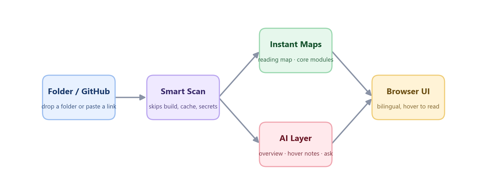

<div align="center">


[](https://python.org)
[](LICENSE)
[](https://github.com/he-yufeng/CodeABC/actions)

[**Quick Start**](#run-it) · [**How It Works**](#how-it-works) · [**Features**](#features) · [中文](README_CN.md)

</div>

**Read code without learning to code.** An AI-powered code reader built for non-programmers.

Cursor and VS Code are Swiss army knives for developers. CodeABC is a magnifying glass for everyone else -- it lets you read code like reading an article, and annotate code like annotating a document.

## The Problem

More and more non-programmers need to deal with code: grad students running Python data analysis scripts, product managers reviewing what developers built, founders evaluating outsourced code quality. But every existing tool assumes you already know how to code.

**AI can already explain code perfectly.** What's missing is a product that wraps this capability in a UX designed for people who don't code.

## How It Works



Drop in a folder or paste a GitHub link. CodeABC scans the project (skipping build output, caches, and secret-shaped files), builds **instant deterministic maps that need no API key** — a reading map, core-module ranking, test-coverage view, and more — then layers AI explanations on top: a plain-language project manual, line-by-line hover annotations, and a Q&A box. Everything shows up in a bilingual browser UI.

## Features

### Project Overview

Drop in a project folder or paste a GitHub link. CodeABC scans the files and generates a plain-language "project manual":

- **What is this?** One-sentence summary anyone can understand
- **File guide** Every file explained in plain language, sorted by importance
- **Reading map** A deterministic "start here, then read this" path appears before the AI call
- **How to run it** Step-by-step instructions, no jargon
- **Quick tips** "If you just want to change X, go to file Y"

### Hover Annotations

Click any file to view it with AI-generated annotations. Hover over any line to see a plain-language explanation of what it does. No programming jargon -- uses everyday analogies to explain concepts.

- Fine-grained: annotations cover every 1-3 lines, not just blocks
- Context-aware: explains _why_ a number is 0.05 or a timeout is 3600
- Cached: annotations are stored locally so repeat visits are instant

### Terminology Dictionary

Every file view lists the programming terms that actually appear in that file -- `async`, `decorator`, `closure`, `middleware`, `regex`, and dozens more. Hover a term to see a plain-language explanation that leans on everyday analogies. It is computed deterministically (no LLM, no API key), so it is instant and always available.

### Natural-Language Editing

Describe a change in plain words -- "把茅台换成比亚迪", "change the timeout from 3600 to 600" -- and CodeABC returns a suggested rewrite of the selected snippet, touching only what you asked for. It never writes to your files; the result is yours to review and copy.

### Q&A Mode

Select any snippet in a file (or just leave it unselected for the whole file) and ask a question in plain language -- "what does this do?", "why is this number here?". CodeABC answers in the same patient, jargon-light voice, grounded only in the code you pointed at. Answers are cached, so asking the same thing again is free.

### Bilingual UI (中文 / English)

The whole interface switches between Chinese and English with one toggle in the header. Your choice is remembered, and the first visit follows your browser language. (LLM-generated content like the manual and annotations follows the prompt language; the UI chrome is fully translated.)

### Cleaner Project Scans

CodeABC skips build outputs, package caches, minified bundles, generated frontend chunks, and paths ignored by the repository's `.gitignore` before sending files to the LLM. It also leaves out secret-shaped files such as real `.env` files, credential JSON files, API key notes, and private keys while still allowing safe examples like `.env.example`. That keeps the project manual focused on source code instead of `dist/`, `node_modules`, local scratch files, one-line JavaScript bundles, or private credentials.

### Start Reading Immediately

Before an LLM response is ready, CodeABC builds a deterministic reading map from README files, likely entry points, package manifests, core source directories, and tests. It gives newcomers a useful first route even when no API key is configured.

### Core Modules at a Glance

CodeABC builds a small import graph from the scanned files and ranks them by fan-in: how many other files import each one. The most-imported files are usually where the real logic lives (shared utilities, data models, core services), so they surface next to the reading map as "core modules", each tagged with the number of files that depend on it. It resolves Python imports (including relative and package imports) and JavaScript/TypeScript imports (relative paths with extension and index resolution), and ignores third-party and standard-library imports since they never point at a scanned file. Like the reading map, it runs without an LLM call, so it works with no API key configured.

### Is the Code Tested?

A blunt but useful question when you're sizing up code you didn't write — work you outsourced, say: does it actually have tests? CodeABC pairs each source file with the test files that exercise it, both by import and by the usual `test_scanner.py` / `scanner.test.ts` naming, then shows the share of files that are covered. More usefully, it ranks the *untested* files by how many other files depend on them: an untested file that half the project imports is exactly where a quiet regression spreads furthest, so it sits at the top of the "worth covering first" list with a plain-language note on why. A green progress bar gives the at-a-glance number; the list tells you where to look. Like the other maps it is deterministic and needs no API key.

### What Does This File Even Do?

`conftest.py`, `serializers.py`, `__init__.py`, `urls.py`, `Dockerfile` — to a developer these names are self-explanatory; to everyone else they are a wall. Open any file and CodeABC puts a one-line plain-language note at the top telling you what a file with that name usually is: that `__init__.py` just marks a folder as a package and is often empty, that `conftest.py` holds shared test setup and isn't project logic, that a `migrations/` file is an auto-generated database change you rarely need to read. It works off the filename alone, matching from the most specific convention down to a bare extension, so it is instant, needs no API key, and is right before the AI has said a word.

### Does It Talk to the Outside World?

Before trusting a script you didn't write, you usually want to know what it reaches out to: which AI provider, which cloud, which database, whether it moves money. CodeABC reads the imports and the hostnames in the code and lists the external services it depends on — OpenAI, AWS, a Postgres database, a Stripe payment call — each with a plain note on what that dependency means and why you might care. No API key required.

### Where Do Errors Get Swallowed?

The most dangerous line in a codebase is often the one that quietly hides a problem: a bare `except:` that catches everything, an empty `catch {}` that throws the error away, a failure that gets logged and then ignored. To a non-coder these are invisible; to a maintainer they are where bugs go to hide. CodeABC flags these silent-failure spots and explains, in everyday terms, why "the program kept going as if nothing happened" can be worse than crashing loudly.

### Which Files Are Begging for Docs?

Not every file needs a comment, but the ones that other files lean on heavily and that still have almost no explanation are the ones that cost a newcomer the most. CodeABC scores each file on how under-documented it is relative to how central it is, and surfaces the handful that would help the most if someone wrote a few sentences at the top. It is a reading aid as much as a writing one: these are usually the files worth understanding first.

## Tech Stack

| Layer | Choice | Why |
|-------|--------|-----|
| Frontend | React 19 + Vite + TailwindCSS 4 | Fast dev, no SSR needed for this app |
| Code highlighting | Shiki | VS Code-quality syntax highlighting, zero runtime JS |
| Tooltips | @floating-ui/react | Lightweight positioning for hover annotations |
| State | Zustand | Minimal, performant state management |
| Backend | FastAPI + uvicorn | Async Python, great for streaming LLM responses |
| LLM | litellm | Multi-provider support (OpenAI, Claude, DeepSeek, Kimi, etc.) |
| Cache | SQLite | Simple, no Redis needed for MVP |

## Run It

One command, no setup:

```bash
python run.py
```

On Windows you can just double-click `start.bat`; on macOS/Linux, run `./start.sh`. The first run builds the web interface and installs dependencies — after that it just starts. Everything is served from one place, and it opens in your browser for you once the server is ready — at http://127.0.0.1:8000, or the next free port if 8000 is already taken. Press Ctrl+C to stop.

You need **Python 3.10+**, plus **Node.js 18+** for that first build. Installing [uv](https://docs.astral.sh/uv/) is optional and makes startup faster.

Then click the gear icon in the top-right and paste an API key (or use the free tier — see [API Key](#api-key)). An [OpenRouter](https://openrouter.ai) key (`sk-or-...`) is the easiest: one key reaches every provider, and CodeABC recognises it automatically and picks a fast, inexpensive model for you. OpenAI, Anthropic, and DeepSeek keys work too. To force a specific model, set `CODEABC_MODEL` (e.g. `openrouter/anthropic/claude-haiku-4.5`).

### Developing

To run the backend and the Vite dev server separately with hot reload:

```bash
# backend (terminal 1)
python3 -m venv .venv && source .venv/bin/activate
pip install -e .
export OPENAI_API_KEY=<OPENAI_API_KEY>   # or ANTHROPIC_API_KEY / OPENROUTER_API_KEY / ...
uvicorn backend.app:app --reload

# frontend (terminal 2)
cd frontend
npm install
npm run dev
```

The dev UI runs at http://localhost:5173 and calls the backend on port 8000.

### Desktop app (Tauri)

The same UI ships as a native desktop window via [Tauri](https://tauri.app) — a small Rust shell around the web frontend, no Electron-sized bundle. It's self-contained: the app bundles the FastAPI backend as a sidecar and starts it automatically, so there's nothing to run by hand. You'll need the [Rust toolchain](https://www.rust-lang.org/tools/install) installed to build it.

```bash
# 1. package the backend into the sidecar binary (clean venv with just the
#    project's deps + pyinstaller; a fat env produces a huge binary)
pip install -e . pyinstaller
python scripts/build_desktop_sidecar.py

# 2. build the desktop app (bundles that sidecar)
cd frontend
npm install
npm run tauri:build    # installer in src-tauri/target/release/bundle/
```

The release app spawns the backend on 127.0.0.1:8000 at launch and stops it on exit. For development, run the backend yourself (`uvicorn backend.app:app --reload`) and use the hot-reloading window — `npm run tauri:dev` doesn't start the sidecar:

```bash
npm run tauri:dev
```

### Using It

1. **Local folder**: Drag a project folder into the upload zone, or click to select
2. **GitHub repo**: Paste a GitHub URL like `https://github.com/user/repo` and click "Analyze"
3. Browse the generated project overview
4. Click any file to see it with hover annotations

### API Key

CodeABC supports two modes:

- **Free mode** (default): Limited to 20 requests per day
- **BYOK mode**: Click the gear icon in the top-right corner to enter your own API key for unlimited use. The key is stored only in your browser's localStorage.

## Project Structure

```
CodeABC/
├── backend/                 # Python FastAPI server
│   ├── app.py               # Entry point, CORS, lifespan
│   ├── desktop_server.py    # Sidecar launcher for the Tauri desktop build
│   ├── models.py            # Pydantic data models
│   ├── routers/
│   │   ├── project.py       # Upload / GitHub clone / file endpoints
│   │   └── analyze.py       # Overview + annotation generation
│   ├── services/
│   │   ├── scanner.py        # Project file scanner with smart filtering
│   │   ├── importgraph.py    # Import-graph fan-in ranking (core-module detection)
│   │   ├── github_clone.py   # Shallow clone with size limits
│   │   ├── llm.py            # litellm wrapper (stream + non-stream)
│   │   ├── cache.py          # SQLite cache + on-disk project library
│   │   ├── codemap_export.py # Stitch every map into one offline codemap.md
│   │   ├── report_export.py  # Self-contained offline HTML report
│   │   └── …                 # + 28 deterministic, no-API-key analyzers (one per map)
│   └── prompts/
│       ├── overview.py      # Project overview prompt
│       ├── annotate.py      # Line-by-line annotation prompt
│       ├── qa.py            # Snippet / file Q&A prompt
│       └── edit.py          # Natural-language editing prompt
├── frontend/                # React + Vite + TailwindCSS
│   └── src/
│       ├── pages/           # Home, Overview, FileView
│       ├── components/      # UploadZone, CodeViewer, AnnotationTooltip, ApiKeyModal
│       ├── stores/          # Zustand state management
│       └── lib/             # API client
├── scripts/                 # Desktop sidecar build (PyInstaller)
├── pyproject.toml
└── README.md
```

The `services/` analyzers are one module per deterministic map: `coverage`, `symbols`, `datamodels`, `settings_map`, `schedules`, `ci_checks`, `release_map`, `entrypoints`, `commands`, `envscan`, `dependencies`, `integrations`, `error_handling`, `techdebt`, `docs`, `complexity`, `churn`, `activity`, `ownership`, `licenses`, `security`, `risk`, `health_score`, `apimap`, `glossary`, `filenames`, `package_purposes`, and `action_plan`.

## Roadmap

### Shipped

The reading experience is already complete end to end: a plain-language project manual, hover annotations, a terminology dictionary, natural-language editing, and snippet Q&A, all in a bilingual UI you launch with one command (or as a native Tauri desktop app). On top of that sit a dozen deterministic, no-API-key maps — reading map, core-module ranking, a project-wide definition index with find-all-references (look up any name to jump to where it's declared and list every place it's used), test coverage, git-history hotspots and ownership, tech-debt markers, env-var surface, entry points, CLI commands, the data-model shapes a project declares (dataclasses, pydantic models, TypedDicts and NamedTuples, with their fields and types), the tunable settings hard-coded as UPPER_SNAKE constants (retry counts, timeouts, default model, feature flags — the values you might change without reading the code), the scheduled and automated tasks a project runs on its own (cron jobs, APScheduler/Celery beat timers, GitHub Actions schedules and JS timers — what fires without you pressing anything, with common cron expressions glossed into plain language), the CI quality gates a change has to pass on push or pull request (the lint, formatting, type-check, test, coverage, security and build steps wired up in GitHub Actions, pre-commit, GitLab CI, CircleCI, Jenkins and friends, each labelled in plain language so a red check stops being scary), how the project ships releases (where the current version lives, which versioning scheme it follows, whether there's a changelog, and whether pushing a tag or cutting a release auto-publishes to PyPI / npm / GitHub Release), external integrations, silent-failure spots, under-documented files, and logic complexity. It all exports offline too: every map stitches into a single `codemap.md`, or a self-contained HTML report you can email to a non-technical stakeholder — no server, no API key, nothing fetched from the network. Analyses also persist to a small on-disk library (`GET /api/projects`), so you can list past projects and reopen one without remembering its id or re-scanning.

### Planned

These are the directions I want to take next, roughly in priority order:

- **Pull-request reading mode** — paste a PR link and get the diff explained in plain language: what changed, why it might matter, and which files to look at first. This is the most-requested extension and a natural fit for the existing annotation engine.
- **Whole-project chat** — Q&A today is grounded in one file or snippet; the next step is a conversation that can reach across the project's maps and source at once, while staying honest about what it actually read.
- **Annotation coverage beyond Python** — hover annotations lead with Python today; bringing JavaScript/TypeScript and Go up to the same depth is mostly prompt and tokenizer work.

Have an idea or a codebase that confuses CodeABC? Open an issue — the roadmap is shaped by what real non-coders get stuck on.

## Contributing

Issues and PRs welcome. This project is in early development.

## Related Projects

CodeABC is one of several tools I've built for working with code. A few others you might like:

- **[CoreCoder](https://github.com/he-yufeng/CoreCoder)** — want to understand how a coding agent really works? Read the whole ~1k-line engine end to end, not a black box.
- **[RepoWiki](https://github.com/he-yufeng/RepoWiki)** — dropped into an unfamiliar codebase? It gives you a guided wiki and a where-to-start reading path, a self-hostable DeepWiki alternative.
- **[FindJobs-Agent](https://github.com/he-yufeng/FindJobs-Agent)** — stop sifting job boards by hand: it ranks postings against your resume and runs mock interviews.
- **[ContractGuard](https://github.com/he-yufeng/ContractGuard)** — catch the risky clauses before you sign: it reads contracts and flags the dangerous bits.
- **[GitSense](https://github.com/he-yufeng/GitSense)** — want to contribute to open source? It finds issues worth your time and gauges whether your PR will get merged.

## License

MIT
